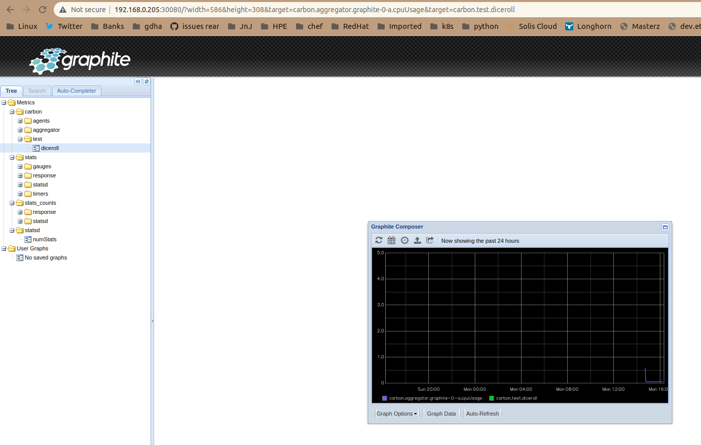

# pi4-graphite

To build the docker image on your Pi4 system execute the following command:

```bash
$ ./build.sh v1.1
Login Succeeded
Building graphite:v1.1
Sending build context to Docker daemon  137.2kB
Step 1/11 : FROM graphiteapp/graphite-statsd:1.1.10-3
1.1.10-3: Pulling from graphiteapp/graphite-statsd
9981e73032c8: Pull complete 
de219cb0be19: Pull complete 
a152a03e3913: Pull complete 
1e02b3e21032: Pull complete 
fb7d8007a803: Pull complete 
Digest: sha256:fb9eb6fdd8f6073dd4ff1acd2169b693d4633045017701713651befbc62fe9f5
Status: Downloaded newer image for graphiteapp/graphite-statsd:1.1.10-3
 ---> 8b4941073bca
Step 2/11 : ENV  GRAPHITE_ADMIN_USER                            "root"
 ---> Running in 82deef0870b8
Removing intermediate container 82deef0870b8
 ---> 455dbd1c4302
Step 3/11 : ENV  GRAPHITE_ADMIN_PWD                             "Password4u"
 ---> Running in a107cc0f6230
Removing intermediate container a107cc0f6230
 ---> 3b61da219d8a
Step 4/11 : ENV  GRAPHITE_ADMIN_MAIL                            "fake.address@example.com"
 ---> Running in 384ec3cdc7b2
Removing intermediate container 384ec3cdc7b2
 ---> 439c659a4ae9
Step 5/11 : ENV  GRAPHITE_TIME_ZONE                             "Europe/Brussels"
 ---> Running in 9bbdd7f7bba7
Removing intermediate container 9bbdd7f7bba7
 ---> db5550957f7a
Step 6/11 : COPY opt/graphite/conf/carbon.conf                  /opt/graphite/conf/carbon.conf
 ---> ddba31c70ff4
Step 7/11 : COPY opt/graphite/conf/storage-schemas.conf         /opt/graphite/conf/storage-schemas.conf
 ---> fa30c92f40ac
Step 8/11 : COPY opt/graphite/bin/django_admin_init.exp         /opt/graphite/bin/django_admin_init.exp
 ---> 33799c289e7f
Step 9/11 : COPY entrypoint.sh                                  /entrypoint.sh
 ---> bde405def024
Step 10/11 : RUN  chmod a+x                                      /entrypoint.sh      && chmod a+x                                   /opt/graphite/bin/django_admin_init.exp      && echo "Europe/Brussels" >                    /etc/timezone
 ---> Running in d6e406adea0e
Removing intermediate container d6e406adea0e
 ---> 00ca074a0a89
Step 11/11 : ENTRYPOINT ["/entrypoint.sh"]
 ---> Running in 170d9cd59ccc
Removing intermediate container 170d9cd59ccc
 ---> afb29746df49
Successfully built afb29746df49
Successfully tagged ghcr.io/gdha/graphite:v1.1
Pushing graphite:v1.1 to GitHub Docker Container registry
The push refers to repository [ghcr.io/gdha/graphite]
2c1f6df34eca: Pushed 
48b1a46c3476: Layer already exists 
b61dbe99c0d2: Pushed 
f1a58751b6e9: Pushed 
80d81709775b: Pushed 
3d375cabc972: Pushed 
654ecaa198c0: Pushed 
5ab5c5bdacc5: Pushed 
54750bb507e7: Pushed 
4f4ce317c6bb: Pushed 
v1.1: digest: sha256:321ebdd99ea86b5b37dce4db41b4b79752e2bff38548c1173e778f51a8a6b7b6 size: 2412
```

Start a graphite pod on your k3s cluster:

```
$ cd kubernetes
$ kubectl apply -f ./graphite-namespace.yaml namespace/graphite created
$ kubectl apply -f ./graphite-secret.yaml secret/graphite created
$ kubectl apply -f ./ghcr-secret.yaml secret/dockerconfigjson-github-com created
$ kubectl apply -f ./persistentvolumeclaim-graphite.yaml persistentvolumeclaim/graphite created
$ kubectl apply -f ./statefulset_graphite.yaml statefulset.apps/graphite created
$ kubectl apply -f ./service_graphite.yaml service/graphite-svc created
```

To find the IP address of the host where pod graphite-0 is running on:

```bash
$ kubectl -n graphite describe pod graphite-0 | grep -i node: | cut  -d/ -f2
192.168.0.205

$ SERVER=$(kubectl -n graphite describe pod graphite-0 | grep -i node: | cut  -d/ -f2)
$ echo "carbon.test.diceroll 5 $(date +%s)" | nc $SERVER 2003 
```

Open a browser with URL http:$SERVER:30080 to see the result of the tests:


